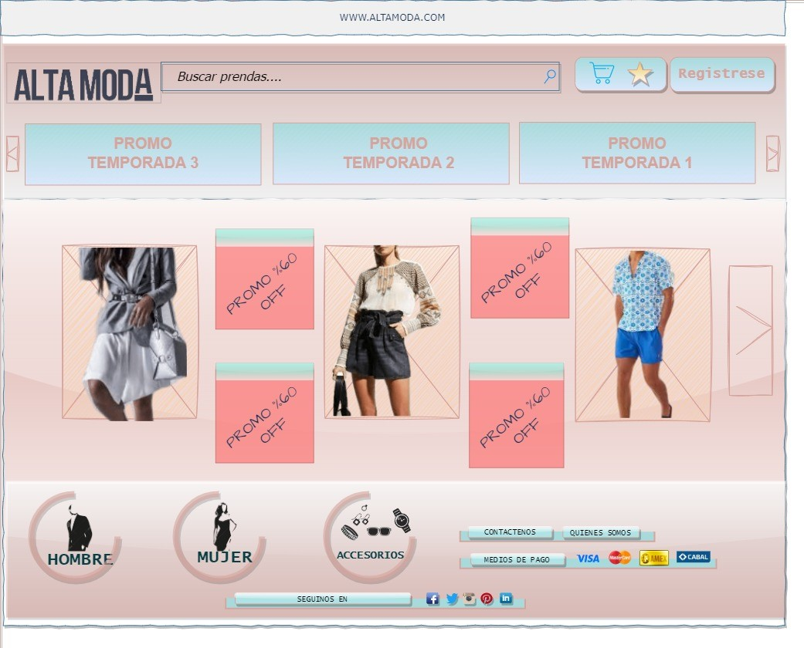

#Grupo 11 - Web Alta Moda
<h3>nuevo titulo/>
<h3>Integrantes:</h3> 
°Yamila Nahir Saavedra 
°Cristian Gabriel Mateo 
°Lucas Rusatti 
°Mariano Renna  

<h2>Enlace a tablero de trabajo</h2>
https://app.diagrams.net/#G1e1gX8Rm9IlwTd0FPbY3dG6suT1fI-YRF

<h2>Tematica del sitio web</h2>  
¿Qué productos o servicios brindará nuestro sitio? 
Indumentaria para mujeres y hombres de alta categoria y marcas de renombre  
¿Quién será nuestra audiencia objetivo? 
Mujeres y hombres mayores de 18 años 
¿Cómo ajustaremos nuestra oferta a ese público? 
Con promociones de temporadas y moda y si la marca lo solicita se adapta el pedido al publico. 

<h2>Logo:</h2>

<h2>WIREFRAME:</h2>
<h4>INDEX</h4>

<h2>Referentes de Mercado</h2> 
https://www.shein.com/ : Posicionamiento líder en mercado global, con enfoque acentuado en las ofertas y cupones con target preferencial femenino. 

https://www.dafiti.com.ar :  Líder en mercado local argentino, destacado en promociones, una app propia y selección de marcas. 

https://www.modatex.com.ar/ : Posee un enfoque con display directo de los productos de temporada. 

https://www.distritomoda.com.ar/  : Hace énfasis en género femenino (por estadística quien realiza mas visitas por webs estadística ). 

https://www.yagmour.com.ar/ : Enfoque en más estilos de un reducido tipo de indumentaria.
Observación del servicio seleccionado. 

<h2>Estudio de Mercado</h2>
Se selecciono el servicio de venta indumentaria online por su crecimiento en el mercado

Se enfoca en venta web por tasa de tráfico superior

Se enfoca en ropa de alta categoría por rendimiento mayores de venta.

Se enfocaran los productos en la variedad con sub atención en ofertas

<h2>Datos de estadisticas:</h2>
https://www.similarweb.com/es/top-websites/lifestyle/fashion-and-apparel/
https://es.fashionnetwork.com/news/Las-mujeres-las-que-mas-compran-por-internet,542603.html#:~:text=El%20perfil%20medio%20de%20compradores,(un%2030%2C1%25) 

